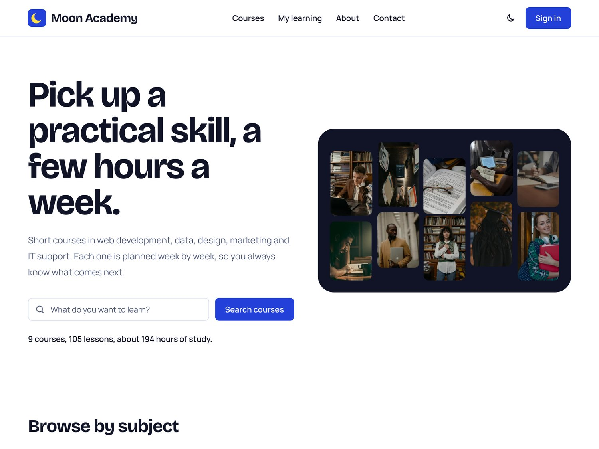
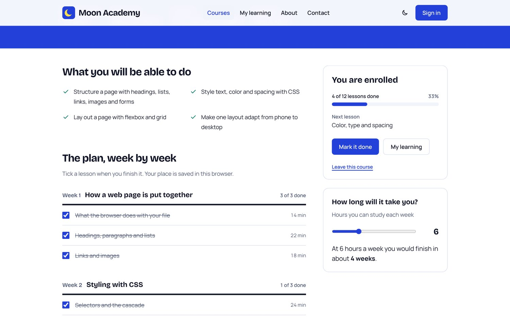

# Moon Academy

A front end for an online course platform, built with React and Tailwind CSS. You can search the catalog, open a course, enroll, tick lessons off, and come back later to find your place.

**Live demo:** https://moon-academy-courses.vercel.app

Moon Academy is a demo. The courses and instructors are sample content, nothing is sold, and everything you do is kept in your own browser.





## What it does

- **Catalog** of nine courses in five subjects. Search looks through titles, summaries, outcomes and lesson names. Subject, level, sort order and the search term all live in the address bar, so a filtered list can be bookmarked or shared.
- **Course page** with the whole plan up front: every week, every lesson and its length. A slider answers "how long will it take me?" from the hours you can study each week.
- **Enrollment and progress.** One click enrolls. Lessons become checkboxes, each week and the whole course show how much is done, and the next lesson is always named.
- **My learning** lists your courses with their progress, lessons done and time studied.
- **Sign in and registration** screens with real validation: errors are announced, and focus moves to the first field that needs fixing. Because this is a demo, any e-mail signs you in and the password is never kept.
- **Contact form** with the same validation.
- **Dark mode**, remembered between visits and applied before the first paint, so the page does not flash.
- Works from a phone to a wide screen, and by keyboard throughout.

## Pages

| Route | Page |
| :-- | :-- |
| `/` | Home: search, subjects, three courses to start with |
| `/courses` | Catalog with search, filters and sorting |
| `/courses/:slug` | Course: outcomes, weekly plan, enrollment, pace planner |
| `/my-learning` | Your courses and progress |
| `/about` | What the demo is and how it is built |
| `/contact` | Contact form |
| `/sign-in`, `/register` | Account screens |

## Built with

- [React 18](https://react.dev) and [Vite](https://vite.dev)
- [React Router 7](https://reactrouter.com)
- [Tailwind CSS 3](https://tailwindcss.com)

No other runtime dependencies. The icons are a handful of inline SVGs, and state is one React context saved to `localStorage`.

## Project structure

```
src/
  data/courses.js      the sample catalog
  lib/learner.jsx      enrollment, progress and the signed-in name, saved in the browser
  components/          navigation, footer, course row and tile, progress bar, form field
  pages/               one file per route
```

## Run it locally

```bash
npm install
npm run dev
```

Then open the address Vite prints in the terminal (usually http://localhost:5173).

## History

The first version of this project was a static landing page with about, contact and sign-in screens. It was rebuilt as a working course platform; the earlier code is in the Git history.
